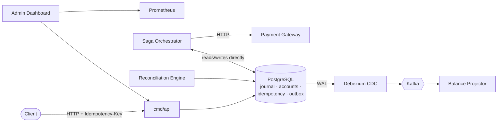

<div align="center">

# Ledger-Core

**A production-grade, event-driven double-entry ledger — the accounting core
that sits underneath a payments platform.**

[](https://github.com/satyamsipah/ledger-core/actions/workflows/ci.yml)
[](go.mod)
[](LICENSE)

[Architecture](docs/ARCHITECTURE.md) ·
[Decisions](docs/DECISIONS.md) ·
[Benchmarks](docs/BENCHMARKS.md) ·
[Runbook](docs/RUNBOOK.md) ·
[API reference](api/openapi.yaml) ·
[Contributing](CONTRIBUTING.md)

</div>

---

## The problem, in three sentences

Payments systems fail in the boring way: money appears twice from a retried
request, a balance goes negative because two writers raced, or an event gets
published for a database write that never actually committed. A ledger is
the one place in a payments stack where "probably correct" is not good
enough — every invariant here needs to be enforced by the database itself,
not merely by application code that could have a bug. This repository is
that ledger: double-entry, event-driven, and built to keep those invariants
under real concurrency, real failures, and real load — not just on the
happy path.

## Architecture



Every arrow into Postgres from `cmd/api` or the saga orchestrator is **one**
database transaction — journal, balance move, outbox row, and (for a saga
step) the saga's own state transition commit together, or none of them do.
See [docs/ARCHITECTURE.md](docs/ARCHITECTURE.md) for the full component
diagram (all seven services, all thirteen tables, all four Kafka topics)
and sequence diagrams for the payout saga's happy, failure and compensation
paths.

## Design decisions and trade-offs

Full reasoning, rejected alternatives, and consequences for each of these
live in [docs/DECISIONS.md](docs/DECISIONS.md) — fifty-nine numbered
decisions across eight phases. The five most load-bearing:

**Double-entry, not a balance column.** A single mutable `balance` field on
an account is one number with no built-in way to know *why* it changed, no
mechanical check that money moving out of one place is money moving into
another, and no way to answer "what did we believe on Tuesday?" once a
correction has overwritten history. Double-entry makes those properties
structural: every movement is at least two signed rows that must sum to
zero, so "where did this balance come from" is always answerable by
`SUM(journal_entries)`, and a correction is a new fact (a reversal) sitting
after the mistake, never an edit to it.

**READ COMMITTED plus explicit row locks, not `SERIALIZABLE`.** Every
invariant here is per-row or per-transaction, so there is no write skew for
`SERIALIZABLE` to catch — it would only add retry overhead uncorrelated
with any bug it prevents. `REPEATABLE READ` converts contention on hot
accounts into retry storms; an explicit `SELECT … FOR UPDATE`, acquired in
one deterministic order across all touched accounts, converts the same
contention into a queue instead — and makes deadlock unreachable rather
than merely rare (D10, D11).

**The transactional outbox, not a dual write.** Writing to Postgres and
publishing to Kafka as two separate operations means a crash between them
either drops an event a commit already promised, or publishes one for a
write that then rolls back. The outbox row commits in the *same* database
transaction as the journal entries it describes; a separate process (CDC,
by default) turns already-committed rows into Kafka messages, so publishing
can lag or retry without ever being able to lie about what happened (D30).

**Saga with compensation, not two-phase commit.** A payout touches a
database this service controls and an external payment gateway that does
not participate in any transaction protocol this side can dictate. 2PC
would need a lock held open across that call — for however long the
gateway takes, including however long it hangs — which is precisely the
failure mode a saga exists to avoid. The trade-off accepted in exchange:
sagas give Atomicity, Consistency and Durability but not Isolation — a
reader can see a debited wallet mid-payout — mitigated by making that
intermediate state self-describing (a named suspense account with its own
`pending_minor`), not by hiding it (D37, D38).

**Hot-account sharding trades liveness for throughput, on purpose.** A
sharded account's overdraft check is enforced per shard, not on the
logical sum — so safety survives sharding completely (you cannot overdraw
the logical account without overdrawing a shard first) but liveness does
not (800 spread across eight 100-shards will refuse a debit of 500 the
account plainly holds). That is why sharding is scoped to accounts whose
traffic is effectively one-directional — house floats, fee collection —
and explicitly not to a drainable customer wallet (D25).

## Benchmarks

Every number below is `make loadtest`'s own output against this repository
— not hand-measured, not a canned fixture — regenerated by anyone who
clones it and reproducible by construction: it tears the stack down
including volumes, rebuilds every image, brings it back up with the read
replica attached, runs five k6 scenarios, and after *each one* proves
correctness (global invariant, projection-vs-journal drift, orphan
detection, and a full async-pipeline rebuild against the Kafka-driven
projection) against that run's own data before moving to the next.

> **Single developer machine running Docker Compose, not a production
> cluster.** Throughput and error rate are stable across runs; p99 latency
> swings roughly 2–4x run to run on shared hardware and should be read as
> an order of magnitude, not a precise figure. Full methodology, hardware,
> and the six-item optimisation cycle behind these numbers (three of which
> were surprises, not confirmations) are in
> [docs/BENCHMARKS.md](docs/BENCHMARKS.md) and D52–D54.

| Scenario | What it isolates | Requests | Throughput (req/s) | p50 | p95 | p99 | Errors | Correctness |
|---|---|---|---|---|---|---|---|---|
| `baseline_simple_transfer` | The reference point every other row is read against | 7,249 | 85.3 | 3.4ms | 13.0ms | 38.8ms | 0.000% | PASS |
| `hot_account` | Row-lock queueing cost (D11) — 90% of traffic on one account | 7,249 | 85.3 | 3.5ms | 18.7ms | 167.4ms | 0.000% | PASS |
| `idempotent_retry_storm` | The idempotency read path (D20) — 30% exact replays | 7,249 | 85.3 | 3.4ms | 10.9ms | 46.4ms | 0.000% | PASS |
| `saga_heavy` | Full RESERVE→GATEWAY→SETTLE payouts, 5% ambiguous gateway failures | 8,035 | 76.8 | 1.8ms | 6.1ms | 12.6ms | 0.000% | PASS |
| `mixed_realistic` | All four above, concurrently, weighted 60/20/15/5 | 10,507 | 91.3 | 3.8ms | 29.5ms | 168.7ms | 0.000% | PASS |

**40,289 real HTTP requests. Zero errors. Zero balance drift** in any
scenario, proven against each run's own data rather than asserted.
Separately, hot-account sharding (32 writers × 8 posts, one logical
account, three runs): **371–444 tx/s single account vs. 1,621–1,965 tx/s
across 16 shards — 4.4×–4.8×, not the naive 16×**, because past a handful
of shards the connection pool and WAL fsync become the bottleneck, not the
row lock.

## What this does NOT do, and why

| Gap | Why it's open |
|---|---|
| **Authorization.** Any authenticated principal can read or post against any account. | D24 closed *authentication* (who is calling); per-principal account ownership is real multi-tenancy design work — single- vs multi-tenant, how it interacts with sharding's `parent_account_id` — deliberately out of scope for the bug D24 fixed. See D47. |
| **In-product resolution for `NEEDS_MANUAL_REVIEW`.** An operator fixes a stuck saga by hand today. | The only automatic fixes available — force-posting with `allow_negative`, or an unexplained `ADJUSTMENT` — mint money no business event justifies. Automatic resolution of a state that exists *because* the system doesn't know what happened is worse than an honest stop. See D43. |
| **A shard rebalancer.** Sharding is safe but not live for a drainable account (see Benchmarks). | The fix is a sibling-to-sibling rebalancer; not built, so sharding is scoped to one-directional accounts only (house floats, fees) rather than customer wallets. |
| **Multi-currency in one transaction.** A transaction posts one currency; the schema is more permissive than the code. | No exchange-rate source and no answer for where FX sub-unit residue lands yet. Posting a transaction spanning currencies without those answers is a rounding bug waiting for a quiet moment (D14). |
| **A Redis idempotency cache.** `Cache` is an interface with a no-op default; Redis runs in `docker compose` but nothing reads from it yet. | Speculative infrastructure is worse than none. `ledger_idempotency_outcomes_total{outcome="cache_hit"}` is the metric that will decide whether the one-Postgres-round-trip cost is actually worth taking a dependency on (D23). |
| **A live deployment anywhere.** Production Dockerfiles, a single-VPS Compose file, and a Helm chart all exist ([deploy/README.md](deploy/README.md)) and are verified statically — `docker build`, `helm lint`, `helm template` piped through `kubeconform`, `actionlint` on the tag-triggered deploy workflow — but none of it has run against a real VPS or cluster. No cloud accounts exist for this project yet; that's genuinely later work, not a design gap. |
| **A rendered API docs deploy.** `docs/api.html` renders `api/openapi.yaml` locally; it isn't hosted anywhere yet. | Hosting it (GitHub Pages or otherwise) is a repo-settings/deployment change, out of scope for a documentation-only phase. |

## Quickstart

Requires Docker and Go 1.25+.

```bash
git clone https://github.com/satyamsipah/ledger-core.git && cd ledger-core
make up      # postgres, redpanda, kafka-connect, redis, api, outbox-publisher,
             # projector, saga-orchestrator, reconciler, mock-gateway, prometheus, grafana
make seed    # load the development chart of accounts
```

| Endpoint | URL |
|---|---|
| API liveness / readiness | http://localhost:8080/healthz, `/readyz` |
| Post a transaction | `POST` http://localhost:8080/v1/transactions |
| API metrics | http://localhost:9090/metrics |
| Prometheus | http://localhost:9099 |
| Grafana ("Ledger Core" dashboard, provisioned) | http://localhost:3001 |
| Admin dashboard (`cd web && pnpm install && pnpm dev`) | http://localhost:3000 |

```bash
curl -X POST http://localhost:8080/v1/transactions \
  -H "Authorization: Bearer $KEY" -H "Idempotency-Key: $(uuidgen)" \
  -H "Content-Type: application/json" \
  -d @- <<'JSON'
{
  "type": "TRANSFER",
  "entries": [
    {"account_id": "...", "direction": "DEBIT",  "amount": {"amount": "1250", "currency": "INR"}},
    {"account_id": "...", "direction": "CREDIT", "amount": {"amount": "1250", "currency": "INR"}}
  ]
}
JSON
```

Send it twice with the same key: the second response is byte-identical and
carries `Idempotent-Replay: true`. Mint `$KEY` with
`go run ./cmd/issue-api-key -principal <id>` — see
[docs/ARCHITECTURE.md#authentication](docs/ARCHITECTURE.md#authentication).

```bash
make test-race   # full suite under the race detector (starts Testcontainers)
make down        # tear down, including volumes
make help        # every target
```

## API reference

[api/openapi.yaml](api/openapi.yaml) is the specification — OpenAPI 3.1 —
and the test suite checks it against the live router in both directions:
every registered route must be documented, and every documented path must
exist. A specification nobody validates rots, and the drift is discovered
by a client integrating against a path that no longer exists.

```bash
open docs/api.html   # rendered, browsable reference; no server needed
```

Every write route requires `Authorization: Bearer <key>`; `GET
/v1/transactions`, `GET /v1/accounts` and their `{id}` counterparts do too,
since a search result carries amounts and external references — the same
class of information D24 already scopes idempotency responses to protect.
`GET /v1/accounts/{id}/balance` and `/statement` do not, since a balance
lookup needs an already-known UUID to begin with. Full route table,
authentication and idempotency mechanics are in
[docs/ARCHITECTURE.md](docs/ARCHITECTURE.md).

## Project structure

```
cmd/api               public HTTP surface
cmd/outbox-publisher   runs whichever outbox publisher LEDGER_OUTBOX_PUBLISHER
                     names -- polling, or a Debezium connector health monitor
cmd/kafka-init       one-shot: provisions the Kafka topic layout, then exits
cmd/projector        Kafka consumer maintaining the read-side balance
                     projection; -rebuild recomputes it from journal_entries
cmd/reconciler       scheduled PSP three-way match + internal consistency checks
cmd/saga-orchestrator  claim loop + timeout sweeper driving payout sagas
cmd/mock-gateway     LOCAL ONLY: a real payment gateway stand-in with
                     injectable failure, latency and two flavours of hang
cmd/issue-api-key    one-shot: mints one API key for one principal, then exits
cmd/chaos-harness    injects real faults (paused containers, held locks,
                     gateway behaviour, clock skew) against a running stack
cmd/loadtest-harness  drives k6, verifies correctness after each scenario,
                     writes docs/BENCHMARKS.md and docs/benchmarks.json
internal/ledger      double-entry domain: Money, entries, ledger.Service
internal/ledger/pgledger  the PostgreSQL repository: locking and SQL
internal/idempotency  request de-duplication (invariant 5)
internal/outbox      transactional outbox (invariant 6)
internal/kafka       topic names, partition counts, explicit per-topic config
internal/projector   consumes and applies events, dedupes by event_id, rebuilds
internal/saga        saga vocabulary and persistence port
internal/saga/payout  the marketplace payout state machine and orchestrator
internal/gateway     external payment gateway client; three-valued outcome
internal/reconciliation  the PSP three-way match engine
internal/consistency  the three structural checks cmd/reconciler runs
internal/auth        API key authentication; hashed at rest, never stored raw
internal/http        router, middleware, health, server lifecycle
internal/db          pgx pool, query-timeout conventions, 40001/40P01 retrier
internal/observability  slog, Prometheus, OpenTelemetry
migrations/          golang-migrate SQL, up and down, eighteen migrations
test/                integration tests against real PostgreSQL and Kafka
deploy/              Docker Compose stack, Dockerfile, Debezium connector, seed
web/                 Next.js admin dashboard -- see web/README.md
api/openapi.yaml     OpenAPI 3.1, checked against the router by the test suite
docs/                ARCHITECTURE.md, DECISIONS.md, BENCHMARKS.md, RUNBOOK.md
```

## Testing strategy

No mocks for database behaviour — every test that exercises write-path
logic runs against real PostgreSQL via Testcontainers, and failure tests
kill something real (a paused container, a `pg_terminate_backend` mid-COMMIT,
a frozen account) rather than flip a boolean, per `.claude/rules/testing.md`.
`internal/ledger`'s own package-local unit tests cover its pure logic
(31.2% of that package in isolation); the write path's real coverage comes
from the integration suite in `test/`, which exercises `pgledger` and the
HTTP layer together against a live database — the number that matters is
`go test ./... -race`, run on every push and PR, not a package-local
percentage. Twenty integration test files, seven package-local ones, four
CI jobs (`build and vet`, `golangci-lint`, `test -race`, `migration
round-trip`). See [docs/ARCHITECTURE.md#tests](docs/ARCHITECTURE.md#tests)
for representative tests grouped by what they prove.

## What I'd do differently at 100x scale

1. **Partition Postgres itself, not just shard hot accounts app-side.**
   D53's benchmarking found the real ceiling at this scale is
   `max_connections`, shared across five services on one instance — not
   row-lock contention. At 100x that wall arrives long before sharding's
   liveness trade-off becomes the binding constraint.
2. **Build the sibling-to-sibling shard rebalancer.** Left undone
   deliberately (see above); at 100x, a sharded account's liveness cost
   stops being a documented curiosity and starts being a real support
   ticket.
3. **Real per-principal authorization**, not just authentication. Fine
   with one or a handful of trusted callers; not fine with a large
   multi-tenant customer base, where "any authenticated principal can post
   against any account" is the actual security boundary that matters.
4. **A deliberate multi-region design**, not a retrofit. Today's one
   primary plus one streaming replica (D54) is single-region by
   construction. Cross-region double-entry accounting is a well-studied,
   genuinely hard problem — I'd want to design the partitioning and
   conflict story up front rather than bolt it on.
5. **Profile the saga claim loop under real contention.** The polling
   claim loop is untested past this benchmark's saga volume; at 100x it's
   the first orchestrator-side mechanism I'd want numbers on before
   trusting it.
6. **Take the Redis dependency, if the metric says so.** D23 deliberately
   deferred it pending `ledger_idempotency_outcomes_total{outcome="cache_hit"}`
   evidence; at 100x, one Postgres round-trip per idempotency check is a
   materially larger fraction of capacity, and that evidence would likely
   exist by then.
7. **An actual DLQ triage tool.** Three Kafka topics with partition counts
   sized for this load (6/12/3/3) need revisiting at 100x regardless, and
   `ledger.events.dlq` today is a topic a person reads by hand — fine at
   this volume, not at that one.

## Documentation

- [docs/ARCHITECTURE.md](docs/ARCHITECTURE.md) — how every subsystem
  works, with sequence diagrams for the payout saga's happy, failure and
  compensation paths
- [docs/DECISIONS.md](docs/DECISIONS.md) — fifty-nine decisions across
  eight phases: what was decided, what was rejected, and why
- [docs/BENCHMARKS.md](docs/BENCHMARKS.md) / [docs/benchmarks.json](docs/benchmarks.json)
  — `make loadtest`'s own output, regenerated by every run
- [docs/RUNBOOK.md](docs/RUNBOOK.md) — one section per production alert:
  what it means, how to confirm and localise it, what to actually do
- [api/openapi.yaml](api/openapi.yaml) / [docs/api.html](docs/api.html) —
  the HTTP contract, spec and rendered reference
- [web/README.md](web/README.md) — the admin dashboard: running it, the
  mock/live data switch, and its structure
- [deploy/README.md](deploy/README.md) — the three ways to run this stack
  (local, single-VPS, Kubernetes) and how they relate; prepared, not yet
  deployed anywhere live
- [CONTRIBUTING.md](CONTRIBUTING.md) — development workflow and
  conventions
- [CLAUDE.md](CLAUDE.md) — invariants, stack, and working agreements this
  repository was built under
