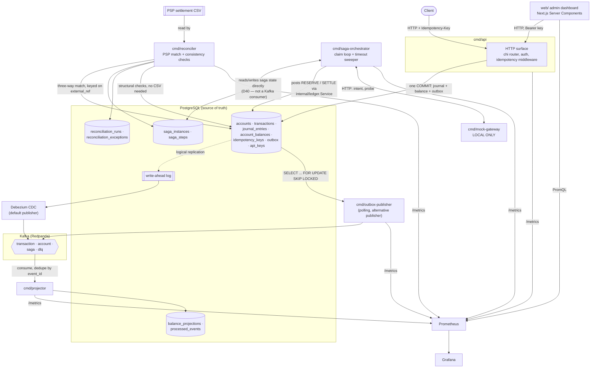
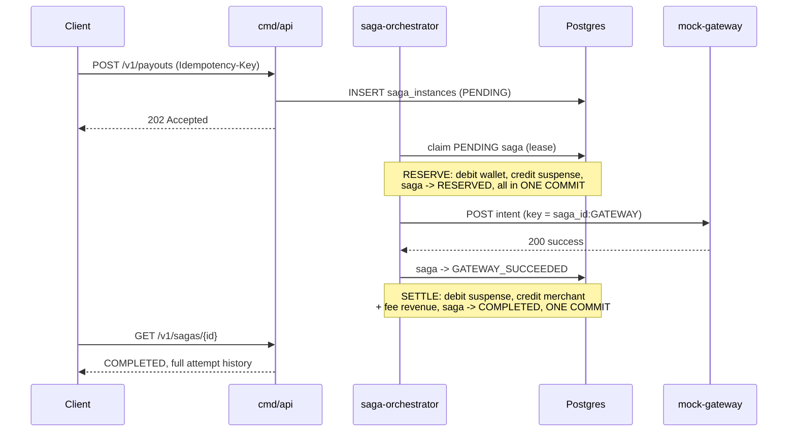
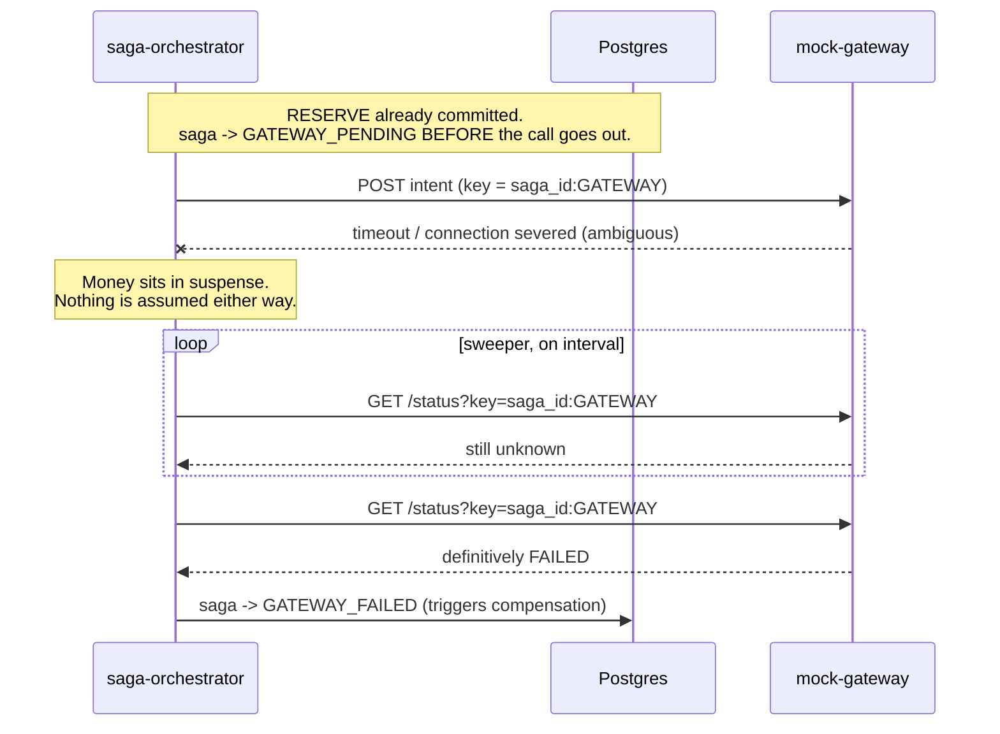
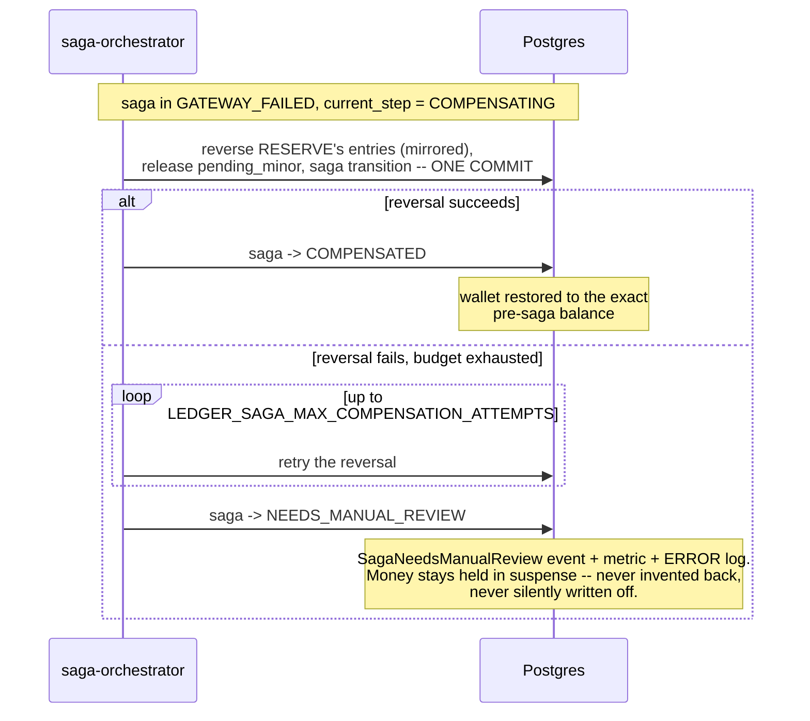

# Architecture

This document is the "how it fits together" and "how each subsystem works."
For "why this design and not another," see
[docs/DECISIONS.md](DECISIONS.md) — every section below cites the decision
numbers behind it rather than re-arguing them.

## System diagram



Every arrow into Postgres from `cmd/api` and `cmd/saga-orchestrator` is one
database transaction: the journal, the balance move, the outbox row, and
(for a saga step) the saga transition all commit together. That single
property — invariant 6, and D20/D41's argument applied twice — is what
makes the rest of this diagram safe to read as "eventually consistent
where drawn with a dashed or async-looking arrow, exactly consistent
everywhere else."

## The write path

### The schema

Thirteen tables. `accounts`, `transactions`, `journal_entries`,
`account_balances`, `idempotency_keys`, `outbox` and `api_keys` are the
write path's own state; `balance_projections` and `processed_events`
belong to the projector, not the write path (see
[The projector](#the-projector)); `saga_instances` and `saga_steps` belong
to the payout saga ([Sagas](#sagas)); `reconciliation_runs` and
`reconciliation_exceptions` belong to `cmd/reconciler`
([Reconciliation](#reconciliation)).

#### How each invariant is enforced

| # | Invariant | Mechanism |
|---|---|---|
| 1 | Transactions balance | `CONSTRAINT TRIGGER ... DEFERRABLE INITIALLY DEFERRED` on `journal_entries`, grouped by `(transaction_id, currency)` |
| 2 | Journal is append-only | `BEFORE UPDATE OR DELETE` row trigger, plus a `BEFORE TRUNCATE` statement trigger |
| 3 | Integer money only | `amount_minor BIGINT CHECK (> 0)`; sign lives in `direction` |
| 4 | No negative balances | `CHECK (allow_negative OR available_minor >= 0)` on `account_balances`, plus `SELECT … FOR UPDATE` on the write path |
| 5 | Idempotent writes | Primary key on `idempotency_keys.key`, plus a partial unique index on `transactions.idempotency_key` |
| 6 | No dual writes | `outbox` table written in the same transaction as the journal; Debezium publishes from the WAL |

#### Why the balance trigger is deferred

Entries are inserted one row at a time, so after the first `INSERT` a
transaction is unbalanced by necessity. An ordinary trigger fires at
statement time and would reject that first row every time, making the
invariant unenforceable rather than merely awkward.

The invariant is a property of the database transaction, not of a row or a
statement, so it is checked at the only moment where it is meaningful:
`COMMIT`. Full reasoning is in
[000005_balance_invariant.up.sql](../migrations/000005_balance_invariant.up.sql).

### Posting

`ledger.Service.PostTransaction` does all of its work in one database
transaction, in this order:

1. **Lock** every account the transaction touches, in one statement,
   ordered by account id. `FOR UPDATE` on `account_balances`,
   `FOR NO KEY UPDATE` on `accounts`.
2. **Validate** against the locked state: every account exists, is
   `ACTIVE`, and holds the entry's currency.
3. **Insert** the header and all journal entries.
4. **Move** each balance by one aggregated delta, guarded by its expected
   version, refusing any move that would overdraw a restricted account.
5. **Append** the outbox event, so it commits with the journal it
   describes.
6. **Commit**, where the deferred trigger has the last word.

#### Isolation and locking

The write path runs at **READ COMMITTED** and prevents lost updates with
explicit row locks rather than with a stronger isolation level. Every
invariant here is per-row or per-transaction, so there is no write skew
for `SERIALIZABLE` to catch, and `REPEATABLE READ` would convert
contention on hot accounts into retry storms where a row lock converts it
into a queue. Full reasoning, and what the trade-off obliges every write
path to do, is in [DECISIONS.md D10](DECISIONS.md).

Locks are always acquired in ascending account-id order, which is what
makes deadlock unreachable rather than merely rare (D11). Replacing that
ordered statement with the obvious per-account version makes
`TestPostTransaction_ConcurrentOppositeTransfersDoNotDeadlock` fail with
real `40P01` errors within seconds.

#### Two sign conventions

A transaction balances under `DEBIT = +, CREDIT = −`, summed per currency.
An account's *balance* is signed differently: positive when an entry's
direction matches that account's normal balance. Without the second
convention, a funded customer wallet — a `CREDIT`-normal `LIABILITY` —
would store a negative balance and trip the overdraft `CHECK`. The two
coincide on `DEBIT`-normal accounts, which is why the tests use wallets.
See the block comment in [types.go](../internal/ledger/types.go).

#### Money

`Money` is `int64` minor units plus an ISO-4217 code, with no float
constructor and no float accessor. `Add`, `Sub` and `Neg` return an error
on currency mismatch and on int64 overflow — including
`Neg(math.MinInt64)`, which has no positive counterpart and would
otherwise silently keep its sign.

It crosses the wire as `{"amount":"1250","currency":"INR","scale":2}`. The
amount is a **string** because the dashboard is TypeScript, where every
JSON number is a float64 and amounts past 2^53 lose precision silently.
Decoding rejects a JSON number outright, and rejects a `scale` that
contradicts the currency — `1250` at scale 0 is a hundred times `1250` at
scale 2, and there is no way to tell them apart after the fact.

#### Reversal

`ReverseTransaction` writes a **new** transaction with every leg's
direction mirrored, and touches the original's `status` column and
nothing else. It can legitimately fail with `ErrInsufficientFunds`:
undoing a transfer moves money back out of the receiving account, which
may have spent it.

## Authentication

`internal/auth` closes [DECISIONS.md D24](DECISIONS.md): every idempotency
key, and every saga's own dedupe, is scoped to the caller who presented
it, and there is no way to be "the caller who presented it" without a
secret this service issued.

```bash
go run ./cmd/issue-api-key -principal acme-corp
# principal: acme-corp
# key:       lk_live_9f2a...
#
# This key is shown once and is not recoverable. Store it now.
```

The key is checked into nothing and stored nowhere as plaintext —
`api_keys.key_hash` is a SHA-256 digest, the same shape
`idempotency_keys.request_fingerprint` already uses. Authentication is one
indexed lookup by that hash; there is no byte-by-byte comparison of a
secret against attacker input for a timing side channel to measure.

**Deliberately not here:** key rotation, listing, an admin API, expiry,
scope. `cmd/issue-api-key` is the entire provisioning surface — a one-shot
CLI in the shape of `migrate` and `kafka-init` — because those are real
admin-dashboard features, and building them to close a namespace-collision
bug would be later work borrowing this fix's authority. Revocation works
today (`UPDATE api_keys SET status = 'REVOKED', revoked_at = now() ...`);
only the API for it is absent.

**What this does not provide: authorization.** An authenticated principal
may read or post against any account — there is no per-principal
ownership check on `accounts`. Closing that is real design work (which
accounts a principal owns, single- or multi-tenant, how it interacts with
sharding's `parent_account_id`) and is out of scope for what D24 needed.
See D47.

## Idempotency

The guarantee: the same key with the same body never creates a second
transaction, at any level of concurrency.

| Same key, and… | Result |
|---|---|
| same body, original completed | `201` replay, `Idempotent-Replay: true`, byte-identical |
| same body, original still running | `409` with `Retry-After` |
| **different** body | `422` |
| replay record expired after 24h | `409` — refused, never re-executed |

Two bodies that differ only in whitespace, key order or number formatting
are the same request: fingerprints are SHA-256 over RFC 8785 canonical
JSON, plus the method and route so one key cannot replay across two
endpoints. Duplicate JSON keys are rejected rather than resolved, because
parsers disagree about which wins and a document with no single meaning
cannot be fingerprinted.

### The one property everything rests on

```
                      ┌──────────┐
   sweeper (24h) ────▶│  ABSENT  │◀──── release (guarded on IN_PROGRESS)
                      └────┬─────┘                     ▲
      reserve: INSERT … ON CONFLICT DO NOTHING         │
      (its own transaction, commits alone)             │
                           ▼                           │
    reclaim   ┌────────────────────────────┐           │
   (lease  ┌─▶│        IN_PROGRESS         │──▶ 409 + Retry-After
    dead)  └──┤   lease_expires_at = …     │           │
              └──────┬──────────────┬──────┘           │
                     │              │                  │
   journal + balances│              │ deterministic    │ transient
   + outbox + record │              │ rejection        │ rejection
   ALL IN ONE TXN    ▼              ▼                  │
              ┌───────────┐  ┌───────────┐             │
              │ COMPLETED │  │  FAILED   │─────────────┘
              └───────────┘  └───────────┘
```

> A record in `IN_PROGRESS` is **proof that no transaction committed under
> that key** — because the move to `COMPLETED` happens in the same
> database transaction as the journal entries.

That single fact is what lets a stale lease be reclaimed with no fencing
token and no lock service, and it is why a crash can leave a delayed retry
but never a duplicate payment. Writing the record in a *separate*
transaction — the textbook shape — breaks it: the work commits, the
completion fails, and the retry correctly reasons that `IN_PROGRESS` means
no commit, and is wrong for the first time. `pgidem.Complete` takes a
`pgx.Tx` rather than a pool so that version cannot be written.

Three defences stand behind it, and the last owes nothing to the first two
being correct: the primary key of `idempotency_keys`; the
`status = 'IN_PROGRESS'` guard on the completing `UPDATE`, which aborts
the loser of a reclaim race and rolls back its journal entries; and
`transactions_idempotency_key_key`.

The 24-hour TTL bounds storage, never correctness. Sweeping removes the
replay record; the key stays reserved forever in `transactions`, so
expiry can lose you a response but never buy you a second transaction.

Redis is specified and not implemented. `Cache` is an interface,
`NoopCache` is the default, and
`ledger_idempotency_outcomes_total{outcome="cache_hit"}` is what will
decide whether the dependency is worth taking on (D23).

## Concurrency

Aborted transactions are retried — but only `40001` and `40P01`, the two
SQLSTATEs PostgreSQL guarantees rolled back nothing. Five attempts, full
jitter uniform over `[0, window)`, and the parent context bounds the whole
sequence so five retries cannot consume five times the deadline the HTTP
layer granted.

Everything else is excluded for cause. A deadline that expired mid-COMMIT,
a reset connection, or any error from COMMIT itself is **ambiguous** — the
transaction may have committed while the answer was lost, and retrying an
ambiguous write in a ledger is how money moves twice. Domain errors are
deterministic; retrying only makes the caller wait longer for the same no.

`ledger_db_tx_retries_total{sqlstate="40P01"}` is a continuous proof of the
ordered locking in D11: a series that stays at zero says the lock
ordering still holds, which is stronger than any single test. Measured,
not assumed — the hot-account contention test reports **0.0000% retries
and zero deadlocks over 500 transactions on one account**.

`LEDGER_LEDGER_ADVISORY_LOCKS=true` adds `pg_advisory_xact_lock` per
account before the row locks. Off by default and honestly second-order:
with ordered locking already in place it moves where writers queue rather
than removing the queue. It is process-wide, never per request, because a
second lock space entered by only some write paths replaces one global
ordering with two.

## Sharding hot accounts

```sql
SELECT ledger_shard_account('<account-uuid>', 8);
```

Writes then hash to a random child and the logical balance is the `SUM`
over children. Shards are ordinary rows in `accounts`, so the composite
foreign key, the deferred trigger, the overdraft `CHECK` and the ordered
locking all keep working untouched.

**Read this before enabling it.** The overdraft check is per row, so:

- **Safety survives.** Every shard is individually non-negative, so their
  sum is. You cannot overdraw the logical account without overdrawing a
  shard first. Invariant 4 still holds.
- **Liveness does not.** 800 spread as 100 across eight shards will refuse
  a debit of 500 the account plainly holds.

So shard only accounts whose traffic is effectively one-directional —
house floats, revenue, fee collection. **A drainable customer wallet must
not be sharded.** A sibling-to-sibling rebalancer would be the fix and is
not built.

Benchmark, 32 writers × 8 posts into one logical account, three runs:

| Arm | Throughput |
|---|---|
| Single account | 371–444 tx/s |
| 16 shards | 1621–1965 tx/s |

**4.4×–4.8×, not 16×.** Past a handful of shards the row lock stops being
the bottleneck and the connection pool, WAL fsync and CPU take over — so
4–8 shards recovers most of the available gain and the rest is largely
wasted. The ratio is the transferable result; the absolute numbers
describe one laptop. See D25 for the rerun of this same comparison under
`make loadtest`.

## Events

Every write that changes state appends a row to `outbox`, inside the same
database transaction as the journal entries it describes — invariant 6,
and the mechanism the dual-write problem does and does not solve is
spelled out in D30. What follows is turning that committed row into a
Kafka message, and this repository ships two ways to do it, behind one
interface, selected by `LEDGER_OUTBOX_PUBLISHER` (`debezium`, the default,
or `polling`):

| | Debezium (default) | Polling |
|---|---|---|
| How | Reads the write-ahead log via a registered connector | `SELECT … FOR UPDATE SKIP LOCKED LIMIT 100`, produces, marks `published_at`, one transaction |
| Ordering | Strict commit (LSN) order | Insertion order — not quite the same thing under concurrency |
| Ops cost | A Kafka Connect cluster, a replication slot to monitor | One more Go binary |

Full comparison — latency, crash behaviour, why `SKIP LOCKED` is what
makes running several polling replicas safe rather than merely running —
is D31.

**The wire format is identical either way.** The full envelope —
`event_id` (UUIDv7), `event_type`, `event_version`, `aggregate_id`,
`occurred_at`, `trace_id`, `payload` — is assembled once, in Go, and
stored as the *entirety* of `outbox.payload`. Debezium's connector does
nothing but relay that column verbatim; that is what makes switching the
config flag a real choice rather than a change in message shape too
(D31's closing argument, D32 for the envelope itself).

Three topics, each on `ledger.events.<name>`, explicit partition counts
and retention rather than broker defaults (`internal/kafka`, provisioned
by `cmd/kafka-init` before anything else starts):

| Topic | Carries | Keyed by | Partitions |
|---|---|---|---|
| `transaction` | `TransactionPosted`, `TransactionReversed` | `transaction_id` | 6 |
| `account` | `AccountCreated`, `BalanceUpdated` | `account_id` | 12 |
| `saga` | `SagaStepCompleted` (declared; no orchestrator emits it yet) | saga id | 3 |
| `dlq` | poison messages, from Connect or from the projector | — | 3 |

**What keying by `account_id` guarantees, and what it does not.** Every
event that ever mentions a given account is delivered to one consumer in
commit order — real per-account ordering. What it does *not* give: a
single transfer's debit and credit are two independent `BalanceUpdated`
messages on two different partitions, with no ordering relationship
between them. A transaction can't be keyed by one account it isn't only
about — see D32 for why `TransactionPosted` is keyed by `transaction_id`
instead, and why the projector below doesn't need the per-account
guarantee anyway.

## The projector

`cmd/projector` consumes `TransactionPosted`/`TransactionReversed` and
maintains `balance_projections` — a read model built **entirely from the
Kafka stream**, independently of `account_balances`, which the write path
updates synchronously under its own row lock. Two numbers computed by
different code paths agreeing is what gives reconciliation a real job.

Applying an event is a version compare-and-set
(`UPDATE … WHERE version < $new`), not a delta — so it converges correctly
regardless of redelivery or arrival order, without needing the
per-account ordering guarantee above at all. `processed_events`, written
in the same local transaction as the projection update, closes the one
gap the compare-and-set alone doesn't: the window between that commit and
this consumer's own Kafka offset commit (D33). Offsets are committed
manually, only after the local transaction succeeds.

An event type this build doesn't recognise is routed to
`ledger.events.dlq` — tagged with its source topic, partition, offset and
the error — rather than wedging every message behind it (D34).

```bash
make rebuild   # or: docker compose run --rm projector -rebuild -accounts <uuid,...>
```

Recomputes every account's balance **directly from `journal_entries`** —
bypassing Kafka, the outbox and every publisher entirely — and diffs it
against the live projection, account by account, exiting non-zero on any
disagreement. `-accounts` scopes it to specific accounts, which is both a
real operational need (a targeted investigation into one customer's
balance) and what makes the check usable against a database other tests
also touch.

## Sagas

A marketplace payout spans an external payment gateway, so it cannot be
one database transaction. What it is instead is three steps, a
compensation, and a defined answer for the case where the gateway's
outcome is unknown.

### Three steps, not five

The business description names five movements. Two of them cannot be
separate steps: a transaction carrying only "debit the customer wallet"
sums to a non-zero value and the deferred balance trigger rejects it at
`COMMIT`. Invariant 1 is not something a saga gets to step around.

| Step | Ledger movement | Compensation |
|---|---|---|
| `RESERVE` | DEBIT wallet / CREDIT platform suspense | reverse it |
| `GATEWAY` | none — the external call | none; resolved by probe, not undone |
| `SETTLE` | DEBIT suspense / CREDIT merchant / CREDIT fee revenue | reverse it |

### The state machine

```
  POST /v1/payouts
        |
        v
   [ PENDING ] --reserve--> [ RESERVED ] --intent--> [ GATEWAY_PENDING ]
        |                                              |     ^      |
        | insufficient funds                     200 OK|     |probe |declined
        v                                              v     |      v
   [ FAILED ]                              [ GATEWAY_SUCCEEDED ]  [ GATEWAY_FAILED ]
   nothing moved                                       |                 |
   nothing to undo                              settle |                 v
                                                       v          [ COMPENSATING ]
                                               [ COMPLETED ]             |
                                                                         v
                                                                  [ COMPENSATED ]
                                                                  every balance
                                                                  exactly restored

  probes exhausted, or compensation exhausted  -->  [ NEEDS_MANUAL_REVIEW ]
                                                    money held in suspense;
                                                    event + metric + log + API
```

Every value of `status` is a **settled** state. There is deliberately no
`RESERVING` or `SETTLING`: a step commits its journal entries and its
transition together, so no crash can leave a saga describing itself as
halfway through something. In-flight-ness is a lease (`lease_owner`,
`lease_expires_at`), the same shape `idempotency_keys` uses, resting on
the same property — a lapsed lease is proof its owner committed nothing.

### The step and the money commit together

`ledger.Tx` gained `CommitSagaStep` and `ApplyPendingDelta`, and
`ledger.TransactionRequest` gained a `Record` hook. A forward step's
journal entries, balance updates, `pending_minor` movement, saga
transition, audit row and outbox event are one `COMMIT`. That is D20's
argument with higher stakes: there, a lost bookkeeping write duplicated a
response; here it would re-run a debit against a customer's wallet.

Consequence: **the saga never writes a `PENDING` transaction header.**
This closes a gap carried since Phase 1 — a `transactions` row reaching
`POSTED` with zero entries — by never taking that path.

### What actually stops a double-spend

Not `pending_minor`. `account_balances_no_overdraft_check` is
`allow_negative OR available_minor >= 0` and does not mention that
column, so a hold written only there is invisible to the constraint and
stops nothing.

The guard is the **suspense debit itself**: once the wallet is debited, a
second payout is refused by invariant 4's existing `CHECK` under the
existing row lock — the ordinary write path's protection, reused
unchanged. `pending_minor` on the suspense account says how much of what
is sitting there belongs to an unfinished saga, which is what makes the
intermediate state self-describing rather than merely visible. It also
gives a reconciliation invariant: `suspense.pending_minor` must equal the
summed amount of every non-terminal saga.

### Three flows through the state machine

The state machine above collapses into three shapes an operator actually
sees. Each is a real, distinct code path — not variations dressed up for
this document.

#### 1. Happy path

Every ledger write and every saga transition commits in the same
database transaction as the step it belongs to; nothing below is two
separate writes hoping to agree.



#### 2. Failure path — an outcome resolved by asking, never by guessing

A timeout, a severed connection and an orchestrator crash mid-call are
indistinguishable from this side, and all three mean the same thing: a
payment may or may not exist. Assuming failure refunds a customer whose
money really left; assuming success pays a merchant for a payment that
never happened. The saga does neither — it sits in `GATEWAY_PENDING` and
the sweeper probes until it gets a conclusive answer (D42). Waiting is
affordable because the money is in a named suspense account: taken from
the customer, not given to the merchant, owned by nobody and lost by
nobody for as long as it lasts.



#### 3. Compensation path

The reversal is mechanical — same accounts, same amounts, opposite
directions — and it is the ordinary `ReverseTransaction` machinery, not a
saga-specific undo. When compensation itself cannot complete, the saga
does not retry forever or paper over the gap: it escalates, loudly, and
leaves the money exactly where it is (D43).



Automatic resolution of `NEEDS_MANUAL_REVIEW` is refused on purpose. A
compensation that burned its whole budget failed for a reason the
orchestrator does not understand, and the only automatic fixes available
— force-posting with `allow_negative`, or an `ADJUSTMENT` — mint money no
business event justifies. A ledger that can silently repair itself is one
whose balances are no longer evidence of anything.

### Running it

```bash
curl -X POST localhost:8080/v1/payouts \
  -H "Idempotency-Key: $(uuidgen)" -H 'Content-Type: application/json' \
  -d '{"customer_wallet_id":"01920000-0000-7000-8000-000000000011",
       "platform_suspense_id":"01920000-0000-7000-8000-000000000005",
       "merchant_payable_id":"01920000-0000-7000-8000-000000000021",
       "fee_revenue_id":"01920000-0000-7000-8000-000000000003",
       "amount":{"amount":"20000","currency":"INR","scale":2},
       "fee":{"amount":"500","currency":"INR","scale":2}}'
```

Returns **202**, not 201: no money has moved yet. Poll
`GET /v1/sagas/{id}` for the outcome and the full attempt history.

To drive the failure paths against the running stack:

```bash
make gateway-behaviour BEHAVIOUR='{"outcome":"decline"}'   # compensation
make gateway-behaviour BEHAVIOUR='{"hang":"after"}'        # ambiguity
docker compose -f deploy/docker-compose.yml pause mock-gateway
make sagas-stuck                                           # the triage list
```

## Reconciliation

`cmd/reconciler` proves the ledger correct against a source of truth this
service does not control: a PSP settlement statement. On a schedule
(daily by default, `LEDGER_RECONCILER_INTERVAL`) it reads a CSV from
`LEDGER_RECONCILER_PSP_CSV_PATH` and three-way matches it against this
ledger's own `transactions` and the saga orchestrator's `saga_instances`,
keyed on `external_ref`.

Every mismatch is classified into one of six categories:

| Category | Meaning |
|---|---|
| `MISSING_IN_LEDGER` | The statement names a reference no transaction carries |
| `MISSING_IN_PSP` | The ledger posted it; the statement never mentions it |
| `AMOUNT_MISMATCH` | The amount or currency disagrees |
| `STATUS_MISMATCH` | e.g. the ledger says `POSTED`, the PSP says `FAILED` |
| `TIMING_DIFFERENCE` | Only the settlement instant disagrees |
| `DUPLICATE` | The statement lists one reference more than once |

Only `TIMING_DIFFERENCE` auto-resolves, and only when the gap is inside
`LEDGER_RECONCILER_TIMING_WINDOW` (default two hours). Every other
category becomes an `OPEN` exception requiring review. The report is
`GET /v1/reconciliation/runs/{id}` — a run's own counts, a breakdown by
category, and every exception it raised; `GET /v1/reconciliation/runs`
lists runs with the same breakdown per row.

**What counts as "the ledger's amount" for a reference.** A single payout
saga posts two transactions sharing one `external_ref` (RESERVE and
SETTLE), so the match takes the *latest* transaction per reference and
reads its amount as the sum of its `DEBIT`-side entries — safe for any
balanced transaction, because invariant 1 already guarantees debits equal
credits, not a rule specific to payouts.

```bash
curl -H "Authorization: Bearer $KEY" localhost:8080/v1/reconciliation/runs
```

Authenticated, unlike the saga read routes — see
[Authentication](#authentication) for `$KEY`. An exception carries
amounts and external references, the same class of information D24
already scopes idempotency responses to a principal to protect.

See [docs/DECISIONS.md](DECISIONS.md) D48 for the match query, the
classification priority order, and why the join runs in SQL while
classification runs in Go.

`deploy/seed/psp_statement.example.csv` shows the format and one row per
category. It is not wired into `docker compose up` by default — unlike
`deploy/seed/seed.sql`, which seeds accounts with no transactions, a
meaningful reconciliation demo needs transactions actually posted with
matching `external_ref` values first. To try it: post a few transactions
with `external_ref` set (e.g. `demo-clean`, `demo-amount-mismatch`), copy
the example file, edit its rows to match what you posted, then point
`LEDGER_RECONCILER_PSP_CSV_PATH` at it and restart `cmd/reconciler`.

## Consistency checks

Alongside the PSP match, `cmd/reconciler` runs three structural checks
against the ledger's own data on a short ticker
(`LEDGER_RECONCILER_CONSISTENCY_INTERVAL`, default one minute) — no
configuration required, unlike the PSP match, because "is our own data
internally consistent" should not wait on an operator pointing this
process at a settlement file:

| Check | What it proves |
|---|---|
| Global invariant | `SUM` of every signed journal entry, per currency, is still zero across the *entire* journal — not merely for the one transaction the deferred trigger last fired on |
| Projection drift | `account_balances` (the synchronous balance, updated under lock) agrees with a full recomputation from `journal_entries` |
| Orphan detection | No `POSTED`/`REVERSED` transaction has fewer than two entries, and no journal entry lacks a parent transaction |

Projection drift here is deliberately not the same check `make rebuild`
already runs — that one diffs the journal against `balance_projections`,
the Kafka-driven read model, to prove the async pipeline agrees with the
ledger. This one diffs against `account_balances`, the write path's own
synchronous balance, closing the three-way triangle D1 originally
described.

Each check reports itself as a Prometheus gauge (`ledger_consistency_*`,
scraped from the metrics port) and, on a violation, an `ERROR` log line
naming the offending currency, account, or transaction ids. The global
invariant gauge is the one to page on: any nonzero value means invariant
1 no longer holds somewhere in the journal.

See [docs/DECISIONS.md](DECISIONS.md) D49 for why these three are plain
query functions rather than a persisted store like the PSP match, and why
proving they actually *detect* a violation needed a private database
rather than the test suite's shared one.

## Observability

`make up` also starts Prometheus (`localhost:9099` — `9090` is the `api`
container's own metrics port) and Grafana (`localhost:3001` — `3000` is
Grafana's usual default, remapped here since it is a common port for
unrelated local dev tooling this stack should not assume it owns;
anonymous viewer access, `admin`/`admin` for changes), both provisioned
automatically: the "Ledger Core" dashboard and the five alert rules below
exist from first boot, nothing clicked together by hand.

**Metrics** follow one convention throughout
(`internal/observability/metrics.go`): every series is
`ledger_<subsystem>_*` plus a `service` label naming which process
emitted it.

| Metric | What it answers |
|---|---|
| `ledger_transactions_posted_total{type,status}` | `PostTransaction`/`reverse` calls, success or error — recorded in `internal/ledger.Service` itself, so saga-originated posts are counted alongside HTTP ones rather than missed |
| `ledger_transaction_duration_seconds{type}` | How long a post or reversal took, success or failure alike |
| `ledger_outbox_lag_seconds` | Age of the OLDEST unpublished outbox row — the number `ledger_outbox_backlog`'s row *count* cannot give you: a thousand rows written a second ago is healthy, five rows sitting for ten minutes is not |
| `ledger_saga_oldest_overdue_seconds` | Age of the most-overdue non-terminal saga — what actually backs the "saga stuck" alert, which a population-by-status gauge alone cannot express |
| `ledger_consistency_*` | The three structural checks above, and the global invariant gauge in particular |

**Tracing** genuinely spans the async boundary. `outbox.trace_parent`
(migration `000018`) carries the full W3C `traceparent` value; both
outbox publishers promote it onto a Kafka message HEADER of the same name
(the polling publisher sets it directly, the Debezium connector via
`table.fields.additional.placement` in
`deploy/debezium/outbox-connector.json`), and `internal/projector.Consumer`
extracts it and starts its `projector.apply_event` span as a real CHILD of
the request that produced the event — not merely a span tagged with a
matching id. `TestProjector_TraceContextPropagatesThroughKafkaHeaders`
proves this with an in-memory span recorder rather than a string
comparison. Set `LEDGER_OTLP_ENDPOINT` on every service to see it in a
real backend (Jaeger, Tempo, anything OTLP/gRPC); with nothing
configured, tracing is a documented no-op
(`internal/observability.NewTracerProvider`) rather than a collector
every request retries against and never reaches.

**Alerts** (`deploy/prometheus/alerts.yml`), each backed by a metric this
codebase computes specifically to make the alert honest:

| Alert | Fires when |
|---|---|
| `LedgerGlobalInvariantBroken` | `journal_entries` stops summing to zero for some currency |
| `LedgerOutboxLagHigh` | Oldest unpublished outbox row exceeds 30s |
| `LedgerProjectionDrift` | `account_balances` disagrees with the journal for ≥1 account |
| `LedgerSagaStuck` | The most-overdue saga has been stuck for over 5 minutes |
| `LedgerReconciliationExceptions` | A reconciliation run recorded a NEW exception in the last day (`increase()`, not a bare threshold — see D50 for why a raw `> 0` on a counter that never resets would misfire permanently) |

[docs/RUNBOOK.md](RUNBOOK.md) has one section per alert: what it means,
how to confirm and localise it, and what to actually do. See D50 for the
rest of the reasoning — in particular why `ledger_transactions_posted_total`
lives in the service layer rather than the HTTP handler, and why testing
the trace-propagation mechanism needed a real span recorder installed as
the process-global provider for one non-parallel test.

## Fault injection and chaos testing

`cmd/chaos-harness` injects the six faults a production ledger actually
needs to survive — DB connection failure, Kafka unavailability, a slow
query, gateway timeout, gateway 500, clock skew — against a real running
stack. Every one is a real mechanism, never a boolean an orchestrator
checks internally: `docker pause`/`unpause` for the first two, a real
held row lock for the third, `mock-gateway`'s own `/control/behaviour`
(D45) for the two gateway faults, and a genuine, narrowly-scoped clock
override (`internal/http.HandleClockSkew`) for the last — see D51 for why
clock skew turned out to have exactly two legitimate targets in this
codebase and not the ones an obvious design would have picked.

Off by default. Nothing above runs, and nothing in the default stack even
exposes the surface to run it, unless you explicitly opt in:

```bash
make chaos-up      # docker-compose.yml + docker-compose.chaos.yml
make chaos-fault FAULT=slow-query BODY='{"duration_seconds":10}'
make chaos-test    # runs the automated chaos test against the running stack
make chaos-down
```

`make chaos-up` layers `deploy/docker-compose.chaos.yml` on top of the
normal stack: it flips `LEDGER_FAULT_INJECTION_ENABLED` to `true` on
`api` and `saga-orchestrator` only, and starts `chaos-harness` — built
from its own `deploy/Dockerfile.chaos-harness`, which runs as root
because it holds `/var/run/docker.sock`, a capability no other image in
this repo has or needs.

`TestChaos_InvariantHoldsUnderRandomFaults` (`test/chaos_test.go`) posts
real transfers against the real API while firing random faults for forty
seconds, tolerating individual request failures — a fault is doing its
job when some of those fail — and asserting only the one thing that must
never be false regardless: the global invariant, checked both the way
every write-path test in this suite already does (`assertGlobalInvariant`)
and via `internal/consistency`'s own checks. It skips itself with an
explanation, rather than failing confusingly, when
`LEDGER_CHAOS_HARNESS_URL`/`LEDGER_CHAOS_API_URL` are not set — it drives
an already-running `docker compose` stack rather than Testcontainers,
because `chaos-harness` pauses containers by name and that only means
something against a stack that is actually running.

## Load testing methodology

`make loadtest` is the entire method, and it is reproducible by anyone
who clones the repository: it tears the stack down (including volumes),
rebuilds every image, brings it back up with the read replica attached,
seeds the chart of accounts, mints a fresh API key, runs five k6
scenarios in sequence, and after each one proves correctness before
moving on — `internal/consistency`'s three structural checks plus
`internal/projector.Rebuild` against the async, Kafka-driven projection,
the same functions `cmd/reconciler -check` and `cmd/projector -rebuild`
wrap for a person to run by hand. `cmd/loadtest-harness` is the program
that does this; [docs/BENCHMARKS.md](BENCHMARKS.md) and
`docs/benchmarks.json` are its literal output, not a hand-edited summary.
Results and the optimisation cycle behind them are in the
[README's benchmark section](../README.md#benchmarks) and D52–D54.

## The admin dashboard

`web/` is a Next.js 14 (App Router) + TypeScript + Tailwind dashboard: a
ledger explorer (search transactions, drill into journal entries, see
the debit/credit balance of each one), an account view (balance,
statement with running balance, a temporal "as of" picker), a saga
monitor (state machine, the manual-review queue, stuck-saga
highlighting), a reconciliation report (exceptions by category,
drill-down), and system health (throughput, latency, outbox lag,
invariant status).

It reads through one seam, `lib/api/client.ts`, that switches between a
built-in synthetic dataset (`LEDGER_DATA_MODE=mock`, the default — no
backend required) and this API over HTTP (`LEDGER_DATA_MODE=live`). Every
view was verified in both modes, and a second time against a real,
populated `docker compose` stack; see D55 and D56 in
[docs/DECISIONS.md](DECISIONS.md) for what that found, and
[web/README.md](../web/README.md) for how to run it.

```bash
cd web && pnpm install && pnpm dev
```

## Tests

No mocks for database behaviour — every test runs against real
PostgreSQL via Testcontainers, because the bugs that matter here live in
the database. `.claude/rules/testing.md` requires failure tests to kill
something real (a container paused, a connection terminated mid-COMMIT, a
frozen account) rather than flip a boolean, and the suite holds itself to
it end to end — from the deferred-trigger tests in Phase 1 through the
chaos harness.

Representative examples, grouped by what they prove rather than by which
phase added them:

**The core invariants, under concurrency.**
`TestPostTransaction_UnderConcurrency` (200 goroutines, five accounts,
final balances checked to the paisa against both the committed transfers
and the journal itself); `TestPostTransaction_ConcurrentOppositeTransfersDoNotDeadlock`
(120 writers, opposite directions, zero deadlocks permitted);
`TestPostTransaction_OverdraftUnderConcurrency` (ten withdrawals racing an
account that can fund four — exactly four succeed);
`TestReverseTransaction_ConcurrentReversals` (twenty simultaneous
reversals of one transaction — exactly one may commit, because two would
each balance perfectly and refund the money twice).

**Idempotency, proven by actually crashing something.**
`TestIdempotency_CrashBeforeCompletionLeavesNoTransaction` parks a posting
transaction between its journal insert and its idempotency completion,
then terminates the backend with `pg_terminate_backend`, and asserts the
rollback left no transaction, a record still `IN_PROGRESS`, and a retry
that succeeds exactly once. `TestIdempotency_SameKeyConcurrentlyPostsExactlyOnce`
fires 100 goroutines at one key and asserts exactly one transaction
exists afterwards.

**The async pipeline, proven against a real broker.**
`TestOutboxPublish_KafkaOutage` pauses the real Redpanda container
mid-run, posts more transactions while it's down, and asserts zero loss
by exact row count once it's back. `TestProjector_RebuildMatchesLive`
posts a mixed workload through the real write path, drains it to a real
broker, consumes and applies it with the real consumer, then diffs the
result against `journal_entries` directly.

**Saga failure paths, against a real gateway process.**
`TestSagaPayout_AmbiguousGatewayOutcomeIsResolvedByQueryNotByGuess` covers
three sub-cases against a genuinely hanging gateway: the payment really
succeeded (settle, don't refund), it never happened (compensate), and the
gateway is killed so it can never say (manual review) — the first two are
indistinguishable to the caller and opposite in fact.
`TestSagaPayout_ConcurrentSagasOnOneWalletCannotDoubleSpend` runs 100
sagas against a wallet that can afford 40, driven by 8 concurrent
orchestrator replicas: exactly 40 complete, 60 are refused, the wallet
lands on exactly zero.

**Mutation-checked guarantees.** The three central saga guarantees were
also checked by mutation: guessing on an ambiguous outcome, forgetting to
release the hold, and dropping the compare-and-set guard from the state
transition each make the corresponding test fail. A test that cannot
fail is not evidence.

See [README's testing strategy](../README.md#testing-strategy) for
coverage figures and how to run the suite.
